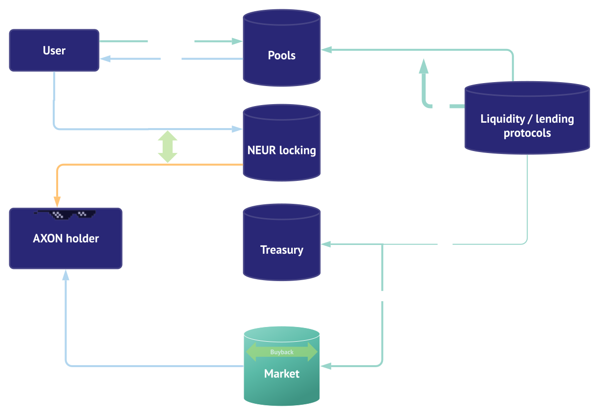

# What are Neuron pools?

Explanation below

Each Pool employs a different alpha seeking strategy, but fundamentally works in a similar manner:

1. Creating the input tokens in relevant project, for example yveCRV/ETH. This is managed automagically by Neuron's contracts, so you don't need to calculate/buy anything!
2. In exchange for depositing, say, 10 steCRV/ETH liquidity pair **Tokens**, a user gets NEURs in accordance to the LP total monetary value \(if one deposits in the beginning of the pool's creation. Otherwise it depends on the ratio or the underlying asset which has appreciated\). 2.1. Neuron protocol will collect the yveCRV reward with 20% performance fee 2.2. which half of it will be sold for ETH, and reinvested back to the sLP. Your pToken will not increase, but when you exit the jar, the steCRV/ETH sLP will be worth more depending when you exit.
3. Investing in a pool will yield you NEUR tokens in addition to the compounding lending/LP asset. Then, 3.1. You can sell your NEURs... 3.2. Or you can lock your NEUR for AXON \(1 NEUR = 1 AXON if locked 4 years\) for the protocol revenue sharing and other perks!

### What are the different Neuron Pools \(nPools\)?

A total of 4 Neuron Pools have been deployed so far:

* steCRV
* FEI-TRIBE
* 3poolCRV
* renBTC

