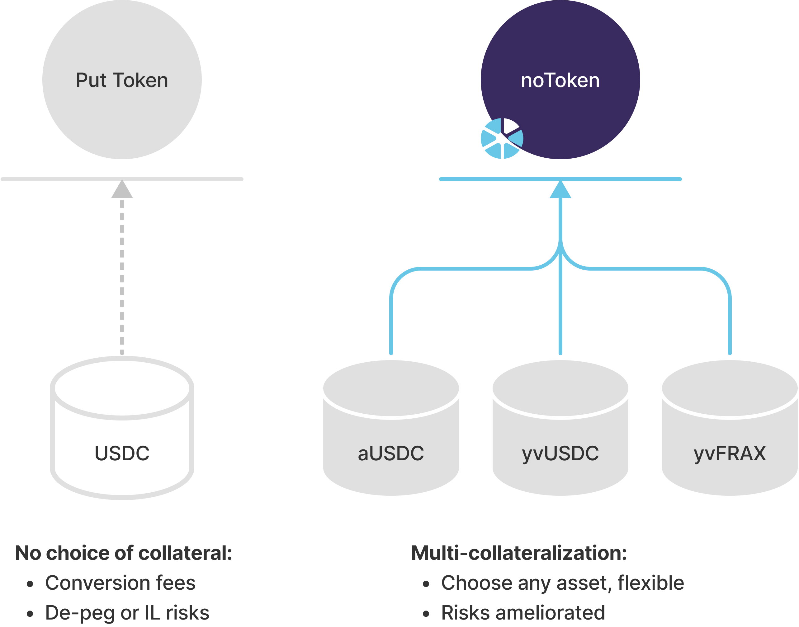

# 🧢 Neuron Options

**noToken**, or Neuron Option Token, is the ERC20-compatible contract representing an option product.&#x20;

All noTokens have eight decimals, and the name and symbol of an noToken are determined by the underlying asset, strike, collateral, expiry, and strike price.

### Neuron Option features

#### ERC20

noTokens can potentially be traded on any DEX due to being ERC20-compatible.

#### Decimals

|  Token  | Decimals |
| :-----: | :------: |
| noToken |     8    |
|   USDC  |     6    |
|   WETH  |    18    |

#### Multi-collateralized

When minting a noToken, the user can choose from a **selection of collaterals** to provide. This brings flexibility and a degree of diversification to using on-chain options.

**Yield-bearing**

Options at Neuron can actually be yield-bearing in addition to pure options' profit potential: users can mint options using **Curve liquidity deposits** as the **collateral**.


Each week, yield-bearing collateral grows by a bit in comparison to the 'raw' token. In addition to, well, yields - this mitigates risks when HODLing long-term, too: the **collateral is growing** and **auto-compounding**!&#x20;

