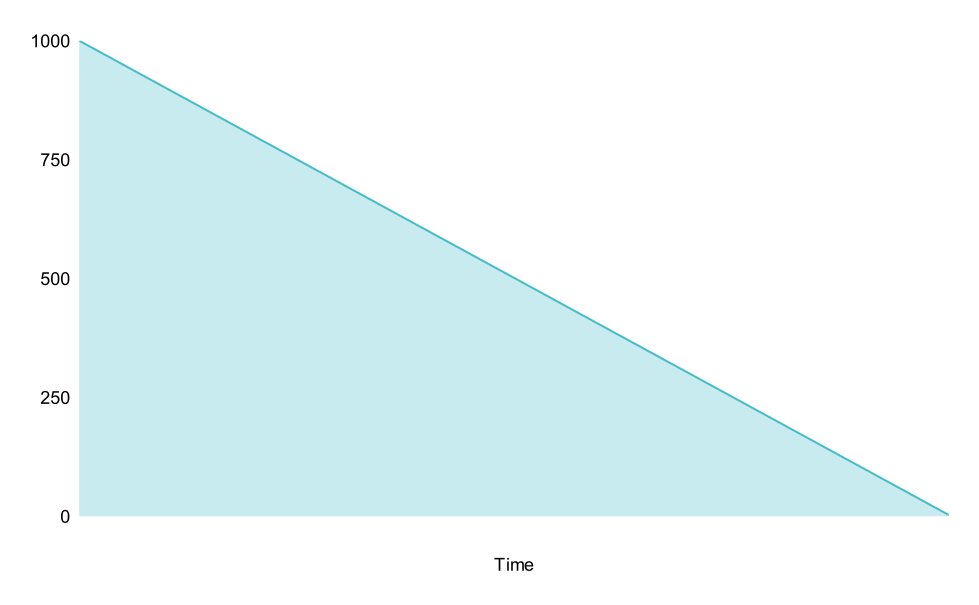

# 🔓 Time-staking

## What is Time-staking?

Time-staking is a modified form of governance staking. Governance voters lock their governance tokens to participate in voting. This prevents governance attacks and aligns incentives between voters and long-term holders.

## Neuron Token (NEUR)

* DAO treasury uses accrued fees to buy back NEUR tokens
* Treasury donates bought-back NEUR as rewards for users with veNEUR balances
* Users can claim their share of bought back NEURs according to the veNEUR balance
* Time-stake (lock) NEUR to receive governance balance (veNEUR balance)

## veNEUR Token

### What is veNEUR?

veNEUR is Neuron's governance and token and is a [vesting and yield system](https://resources.curve.fi/guides/staking-your-crv) based on Curve’s [veCRV mechanism](https://resources.curve.fi/guides/boosting-your-crv-rewards). Users may vote-lock up their NEURs for up to 2 years for the same amount of veNEUR (e.g., 100 NEUR locked for four years returns 100 veNEURs), or anything in between to:

1. &#x20;Participate in [voting](../dao/governance.md) (1 veNEUR = 1 vote)
2. Receive a [share of protocol's revenue](../dao/profit-sharing.md), distributed in weekly NEURs


Unlike typical ERC-20 tokens, **veNEUR is not a transferable token**, nor does it trade on liquid markets.


We've prepared [a detailed guide](../how-tos/locking-neur-for-veneur.md) on interacting with veNEUR on the UI.

### How is veNEUR balance calculated?

veNEURs represent one’s balance of NEURs that have been locked, weighed for the time remaining in the lock. The longer the time remaining in the lock, the more veNEUR a user will have for the same amount of locked NEURs:

| 1 NEUR x 1 week       | \~0.0096 veNEUR&#xD; |
| --------------------- | -------------------- |
| 1 NEUR x 0.5 years    | 0.25 veNEUR          |
| 1 NEUR x 1 years&#xD; | 0.5 veNEUR           |
| 1 NEUR x 1.5 years    | 0.75 veNEUR          |
| 1 NEUR x 2 years      | 1 veNEUR             |

The number of veNEURs and, subsequently, voting power **decrease linearly over time**. In the meantime, the user can also increase their veNEUR balance by locking up more NEUR, extending the lock end date, or both. 2 years = 100% weight, 1 year = 25% weight, etc.&#x20;

Basically, if a user locked 2000 NEURs for a year (or 1000 NEURs for two years), their _voting power over time_ will look like that, slowly declining:

##


Each account can only have a **single veNEUR lock** (of a certain duration).


The longer the lock, the **more voting power** and **influence**, and the more **rewards** can be earned. Users therefore have to **constantly extend their locks** (up to the maximum 4 years) in order to maintain their weight.


It should be noted that veNEUR is non-transferable, and each account can only have a single lock duration meaning that **a single address cannot lock specific NEUR tokens for two years, then another set of NEUR tokens for three years,** etc. All NEUR per account must have a uniform lock time.&#x20;


## How do I vote?

One important veNEUR use case is off-chain voting: first, Neuron Improvement Proposals (NIPs) are created on [the project’s forum; then, those](https://forum.neuronfund.io) passing the first voting barrier are transported to our Snapshot gasless voting space. More on that in our [Governance](../dao/governance.md) section.

## What if I provide liquidity in multiple pools?

Your voting power applies to all pools but may produce different boosts based on how much liquidity you provide and total liquidity the pool has.

## What happens if more people vote lock?

If other liquidity providers vote lock more NEUR, your boost will stay what it was when you applied it. If you abuse this, another user can kick and force a boost update to take you down to your real boost.

## How often do my boost and voting power change?

Your voting weight decreases over time, but your boost will take notice of your decreasing voting power at certain checkpoints like withdrawing, depositing into a gauge, or minting NEUR.

For example, if you start at 1000 veNEUR and your voting power decreases to 800 veNEUR, your boost will still use your original voting power of 1000 veNEUR until a user checkpoint.
